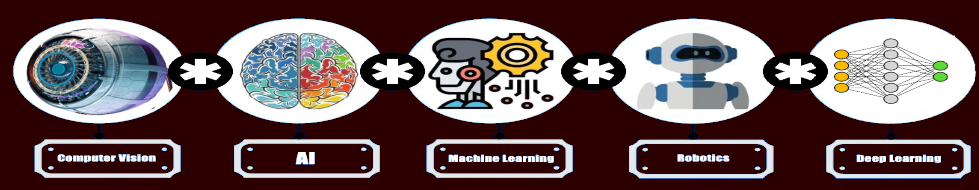

  
  

   

Repositories about some of my Research and Innovation work in Machine Learning, Deep Learning, and Computer Vision. ​🥼​👩‍🔬​

## Technologies

  
  
  
  
  
  
  
  
  
  
  

   

## Blog Posts

<a href="https://azad-wolf.medium.com" target="_blank"> Learning Articles in ML/DL </a>

## Links  

  

